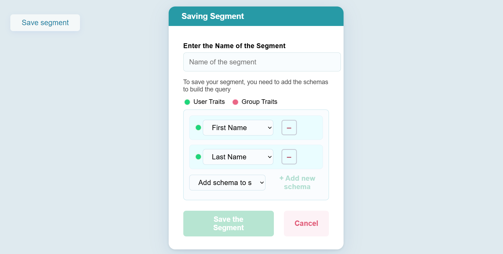

This project is a React application developed as part of the CustomerLabs assessment process. The application allows users to create and save custom segments by selecting and combining user and group traits from a predefined list. Users can add multiple schema traits, edit or remove them, and assign a segment name. When “Save the Segment” is clicked, the segment data is sent as JSON to a webhook URL in the required format.

The interface and user flow closely match the design and behavioral requirements shared in the assessment instructions and attached reference image. This solution demonstrates robust React component architecture, proper state management, dynamic dropdown control (with duplicate prevention), and professional CSS styling.

